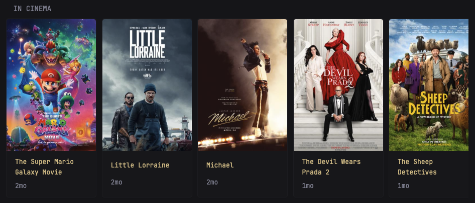
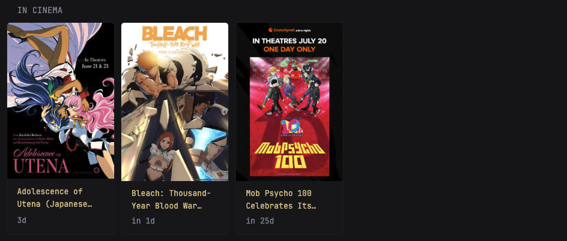

# Description
This widget fetches movies that are currently playing in your Cineplex cinemas using their site API



# Parameters
- `subscription-key`: `ocp-apim-subscription-key` request header found in requests to apis.cineplex.com
- `filter-keyword`: only show movies with name containing this keyword
- `playing-now-only`: only show movies that have `isNowPlaying` set to true

# Example Configuration



```yaml
- type: custom-api
  title: In Cinema
  frameless: true
  cache: 1h
  options:
    subscription-key: "abc"
    filter-keyword: "Japanese"
    playing-now-only: false
    items: 10
  template: |
    {{ $baseURL := "https://apis.cineplex.com/prod/cpx/theatrical/api/v1/movies/bookable?language=en" }}
    {{ $subscriptionKey := .Options.StringOr "subscription-key" "" }}
    {{ $filterKeyword := .Options.StringOr "filter-keyword" "" }}
    {{ $playingNowOnly := .Options.BoolOr "playing-now-only" false }}
    {{ $numberOfItems := .Options.IntOr "items" 10 }}
    
    {{ if eq $subscriptionKey ""}}
        <div class="widget-content-frame" style="flex=0 0 auto; display:flex">
            <div class="grow padding-inline-widget margin-top-10 margin-bottom-10 color-negative">
                ocp-apim-subscription-key not set.
            </div>
        </div>
    {{ else }}
      {{ $today := now | formatTime "6/24/2026"}}
      {{ $requestURL := concat $baseURL "&date=" $today }}
      
      {{ $items := newRequest $requestURL | withHeader "ocp-apim-subscription-key" $subscriptionKey | getResponse }}
      {{ if eq $items.Response.StatusCode 200 }}
        {{ $movies := $items.JSON.Array "" | sortByString "releaseDate" "asc" }}
        {{ $len := len $movies}}
        {{ $shown := 0 }}
        
        {{ if gt (len $movies) 0 }}
            <div class="cards-horizontal carousel-items-container">
              {{ range $i, $_ := $movies }}
                {{ $el := index $movies $i }}
                {{ $releaseDate := $el.String "releaseDate" | parseTime "2006-01-02T15:04:05" }}
                {{ $movieName := $el.String "name" }}
                {{ $hasKeyword := true }}
                {{ if not (eq $filterKeyword "" )}}
                    {{ $hasKeyword = findMatch $filterKeyword $movieName }}
                {{ end }}
                {{ $nowPlaying := $el.Bool "isNowPlaying" }}
                {{ if not $playingNowOnly }}
                    {{ $nowPlaying = true }}
                {{ end }}
                {{ if and (lt $shown $numberOfItems) $nowPlaying $hasKeyword }}
                     
                     <a class="card widget-content-frame"
                        href="https://www.cineplex.com/movie/{{ $el.String "filmUrl" }}"
                        style="
                            flex: 0 0 auto; 
                            width: 180px;
                            min-heght: 260px; 
                            display:flex; 
                            flex-direction:column; 
                            box-sizing:border-box;
                            text-decoration:none; 
                            color:inherit;"
                     >
                     <div style="position: relative;">
                        {{ if and ($el.Exists "mediumPosterImageUrl") (ne ($el.String "mediumPosterImageUrl") "") }}
                            
                         {{ else }}
                            <div style="width:100%; background:#222; display:flex; align-items:center; justify-content:center; color:#ddd; aspect-ratio:2/3;">
                              No image
                            </div>
                         {{ end }}
                     </div>
                     <div class="grow padding-inline-widget margin-top-10 margin-bottom-10">
                          <ul class="flex flex-column justify-evenly margin-bottom-3" style="height:100%; gap: 4px;">
                            <li class="text-truncate-2-lines color-primary" title="{{ $movieName }}">
                              {{ $movieName }}
                            </li>
                            <li class="text-truncate" {{ $releaseDate | toRelativeTime }}></li>
                          </ul>
                       </div>
                     </a>
                {{ $shown = add $shown 1 }}
                {{ end }}
              {{ end }}
            </div>
        {{ else }}
            <div class="widget-content-frame" style="flex=0 0 auto; display:flex">
              <div class="grow padding-inline-widget margin-top-10 margin-bottom-10">
                No upcoming entries on the watchlist.
              </div>
            </div>
        {{ end }}
      {{ else }}
         <div class="widget-content-frame" style="flex=0 0 auto; display:flex">
              <div class="grow padding-inline-widget margin-top-10 margin-bottom-10">
                Failed to fetch items (status {{ $items.Response.StatusCode }})
              </div>
         </div>
      {{ end }}
    {{ end }}
```